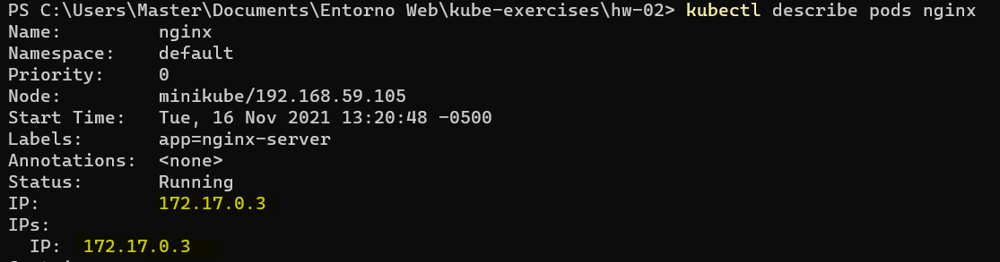
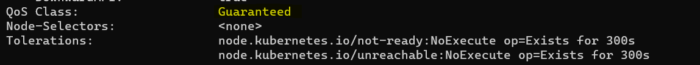

# Ejercicio 1

### 1. ¿Cómo puedo obtener las últimas 10 líneas de la salida estándar (logs generados por la aplicación)?

Ejecutando el siguiente comando:

```bash
kubectl --tail 10 logs nginx
```

### 2. ¿Cómo podría obtener la IP interna del pod?

Ejecutando el siguiente comando:

```bash
kubectl describe pods nginx
```

Aqui se puede ver la IP interna del pod:


### 3. ¿Qué comando utilizarías para entrar dentro del pod?

```bash
kubectl exec -it nginx -- sh
```

### 4. Necesitas visualizar el contenido que expone NGINX, ¿qué acciones debes llevar a cabo?

Tomando en cuenta que en la declaración del pod se indicó los siguiente:

```bash
      ports:
        - containerPort: 80
```

Al ejecutar el siguiente comando, se puede ver el contenido que expone NGINX en http://localhost:8080 :

```bash
kubectl port-forward nginx 8080:80
```

### 5. Indica la calidad de servicio (QoS) establecida en el pod que acabas de crear. ¿Qué lo has mirado?

Ejecutando el siguiente comando:

```bash
kubectl describe pods nginx
```

Aqui se puede ver la calidad de servicio asignada al pod:


Le fue asignada esta calidad porque:

- Cada contenedor del pod tiene un límite de memoria y una solicitud de memoria.
- Para cada contenedor en el pod, el límite de memoria es igual a la solicitud de memoria.
- Cada contenedor del pod debe tiene límite de CPU y una solicitud de CPU.
- Para cada contenedor en el pod, el límite de CPU es igual a la solicitud de CPU.
