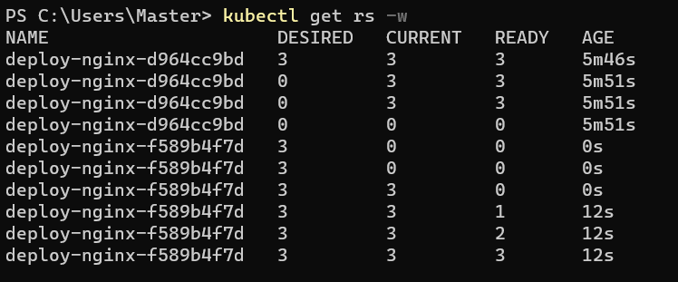
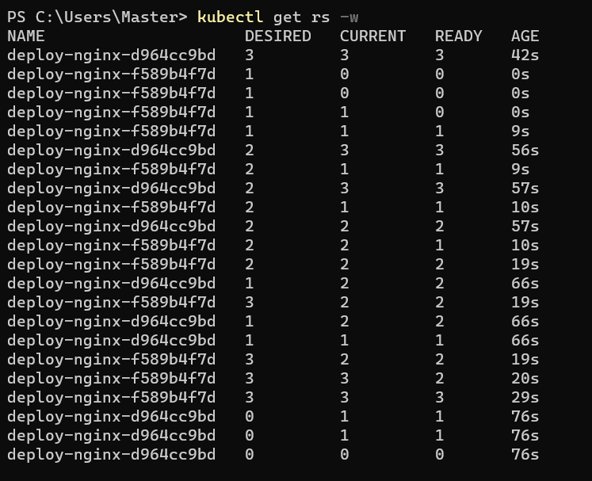
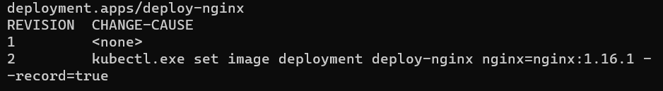

# Ejercicio 4

## Comando para realizar el update de la version de la imagen de nginx

```bash
kubectl set image deployment deploy-nginx nginx=nginx:1.16.1 --record=true
```

## Comando para realizar un rollback a la versión generada previamente

```bash
kubectl rollout undo deployment deploy-nginx
```

## Estado de ReplicaSets en despliegue con "Recreate"



## Estado de ReplicaSets en despliegue con "Rolling Update" (Strategy por default)



## Historial de rollback


