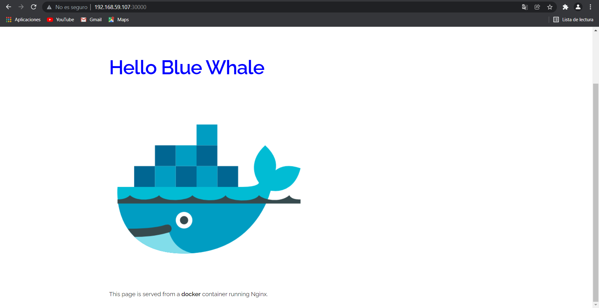
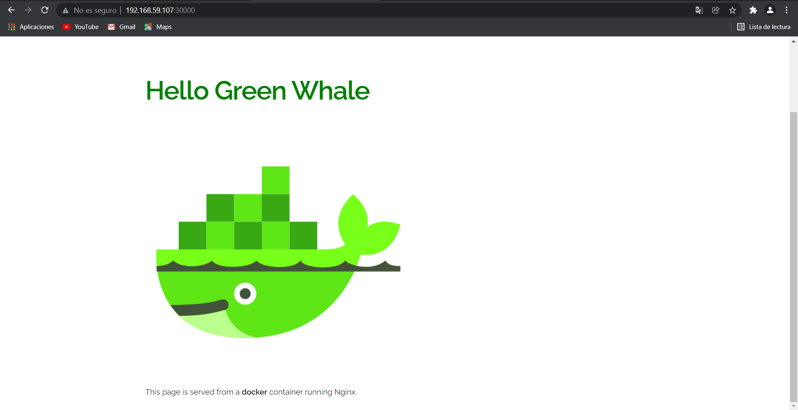

# Ejercicio 5

### 1. Se crean dos objetos de tipo Deployment

### 2. Se crea un servicio que incialmente apunta al label version: 1.0

Al acceder al puerto de minikube donde se expone el servicio se ve lo siguiente:



### 3. Se ejecuta el siguiente comando para cambiar el selector del servicio al label version: 2.0

```bash
 kubectl patch service blue-green-svc --patch '{\"spec\":{\"selector\":{\"version\":\"2.0\"}}}'
```

Al acceder nuevamente al puerto de minikube donde se expone el servicio se ve lo siguiente:



### 4. Se puede matar el deployment azul sin generar indisponibilidad:

```bash
 kubectl delete deploy blue-deploy
```
