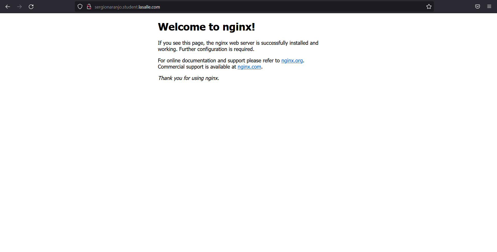
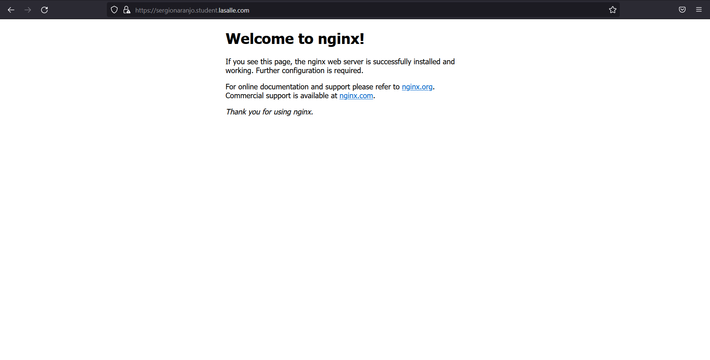
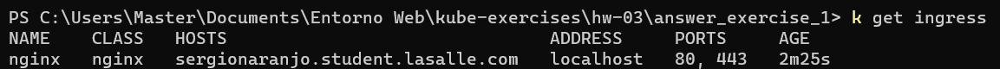

# Ejercicio 1

## Crear ReplicaSet

```bash
kubectl apply -f ./answer_exercise_1_rs.yaml
```

## Crear Service

```bash
kubectl expose rs rs-nginx --name=svc-nginx --port 8080 --target-port 80
```

## Crear Ingress

```bash
kubectl apply -f ./answer_exercise_1.yaml
```

Accediendo al dominio se puede ver que la conexion no es segura (http)


## Crear Certificado (Self Signed)

```bash
openssl req -x509 -nodes -days 365 -newkey rsa:2048 -out answer_exercise_1.crt -keyout answer_exercise_1.key -subj "/CN=sergionaranjo.student.lasalle.com/O=sergionaranjo.student.lasalle.com"
```

## Crear Secret

```bash
kubectl create secret tls secret-ingress-tls --key answer_exercise_1.key --cert answer_exercise_1.crt
```

## Agregar Secret a la declaracion de Ingress

```bash
  tls:
    - hosts:
        - sergionaranjo.student.lasalle.com
      secretName: secret-ingress-tls
```

## Aplicar Cambios

```bash
kubectl apply -f ./answer_exercise_1.yaml
```

Accediendo al dominio se puede ver que la conexion es segura (https)


El ingress controller utiliza los puertos 80 y 443 (http, https)

