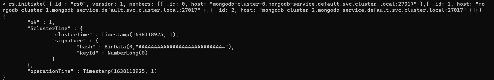
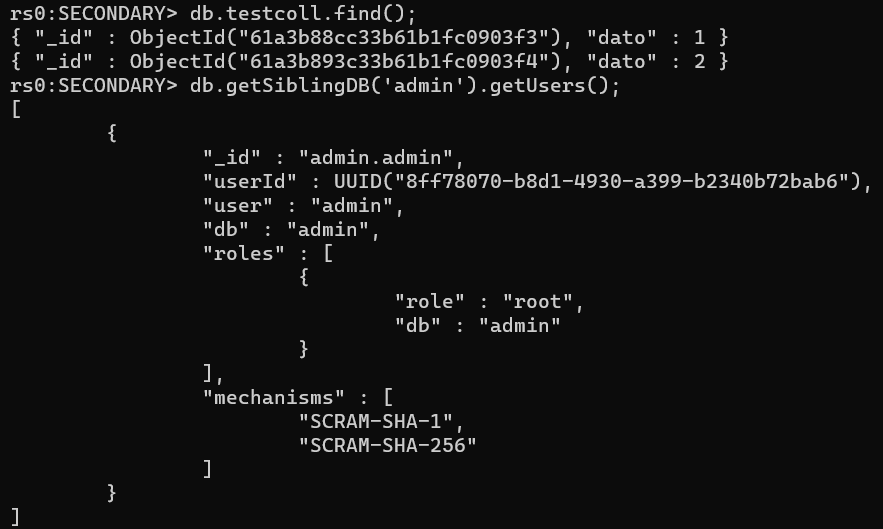
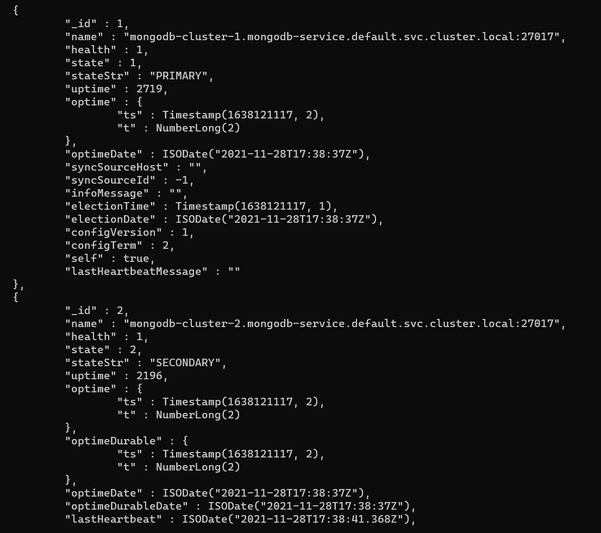

# Ejercicio 2

## Crear Headless Service

Un Headless Service es aquel que no hace load balancing Y cuando se combina con StatefulSets, esto nos dará DNS individuales para acceder a nuestros pods y, a su vez, una forma de conectarnos a todos nuestros nodos MongoDB individualmente. Podemos asegurarnos de que el servicio sea sin cabeza verificando que el campo clusterIP esté establecido en None.

```bash
kubectl apply -f ./answer_exercise_2_service.yaml
```

## Crear StatefulSet

Se crea un StatefulSet con imagenes de MongoDB e indicadores de línea de comando que configuran el nombre del conjunto de réplicas. También monta el volumen de almacenamiento persistente en / data / db: la ubicación donde MongoDB guarda sus datos. Finalmente, está el volumeClaimTemplates. Esto es lo que habla con StorageClass para aprovisionar el volumen. Aprovisiona un disco de 1 GB para cada réplica de MongoDB.

```bash
kubectl apply -f ./answer_exercise_2.yaml
```

## Ingresar a uno de los Pods para crear el cluster

```bash
kubectl exec mongodb-cluster-0 -it bash
```

## Entrar a la config de mongo

```console
# mongo
```

## Configurar Cluster de Mongo

```console
# rs.initiate( {_id : "rs0", version: 1, members: [{ _id: 0, host: "mongodb-cluster-0.mongodb-service.default.svc.cluster.local:27017" },{ _id: 1, host: "mongodb-cluster-1.mongodb-service.default.svc.cluster.local:27017" },{ _id: 2, host: "mongodb-cluster-2.mongodb-service.default.svc.cluster.local:27017" }]})
```

Confirmacion de que se ejecuto correctamente el comando


## Crear un Usuario Admin

```console
# db.getSiblingDB("admin").createUser({user : "admin", pwd  : "admin123", roles: [ { role: "root", db: "admin" } ]});
```

## Ingresar datos

```console
# db.getSiblingDB('admin').auth("admin", "admin123");
# use test;
# db.testcoll.insert({dato:1});
# db.testcoll.insert({dato:2});
# db.testcoll.find();
```


## Verificar datos del cluster

```bash
kubectl exec mongodb-cluster-1 -it bash
```

### Entrar a la config de mongo

```console
# mongo
```

### Verificar datos

**setSecondaryOk()**: Permite operaciones de lectura en miembros secundarios para la conexión MongoDB.

```console
# db.getSiblingDB('admin').auth("admin", "admin123");
# db.getMongo().setSecondaryOk();
# use test;
# db.testcoll.find();
# db.getSiblingDB('admin').getUsers();
```



## Verificar Clusterizacion

Borrar pod principal

```bash
kubectl delete pod mongodb-cluster-0
```

Tras borrar el pod uno de los otros pod pasa a ser el principal


## Diferencias que existiría si el montaje se hubiera realizado con el objeto de ReplicaSet

Si se utiliza el ReplicaSet los pods cambiarían su nombre por lo que el DNS interno no encontraria los nombres configurados en mongo para el cluster (ej. mongo-cluster-0). Ademas a la hora de escalar y desescalar no se haría de manera ordenada si no aleatoria.

# Fuente

- https://docs.mongodb.com/manual/tutorial/deploy-replica-set/
- https://deeptiman.medium.com/mongodb-statefulset-in-kubernetes-87c2f5974821
