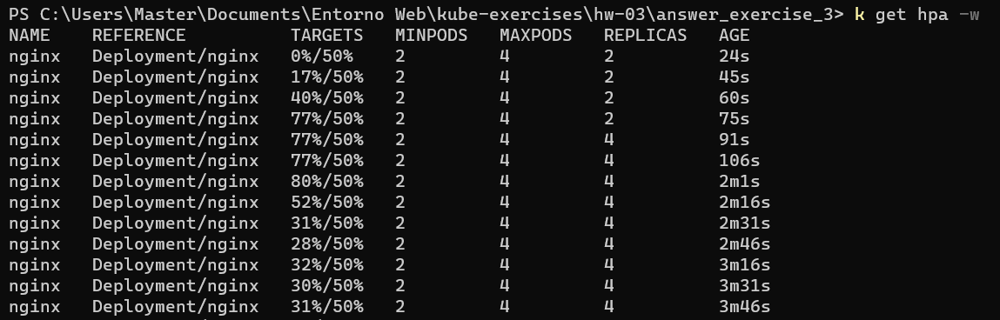

# Ejercicio 3

## Crear Deployment y Service

```bash
kubectl apply -f ./answer_exercise_3.yaml
```

## Crear HPA

```bash
kubectl autoscale deployment nginx --cpu-percent=50 --min=2 --max=4
```

## Usar Load Generator

```bash
kubectl run -i --tty load-generator --rm --image=busybox --restart=Never --/bin/sh -c "while sleep 0.01; do wget -q -O- http://nginx-svc; done"
```

## Escalamiento Horizontal


